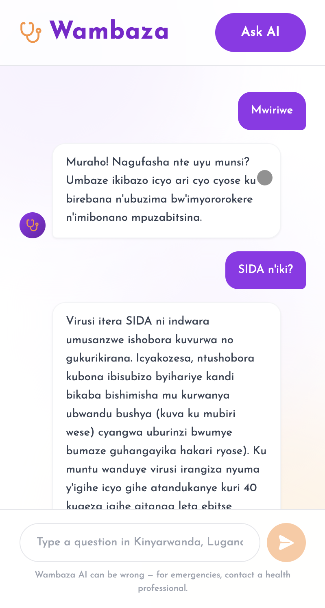
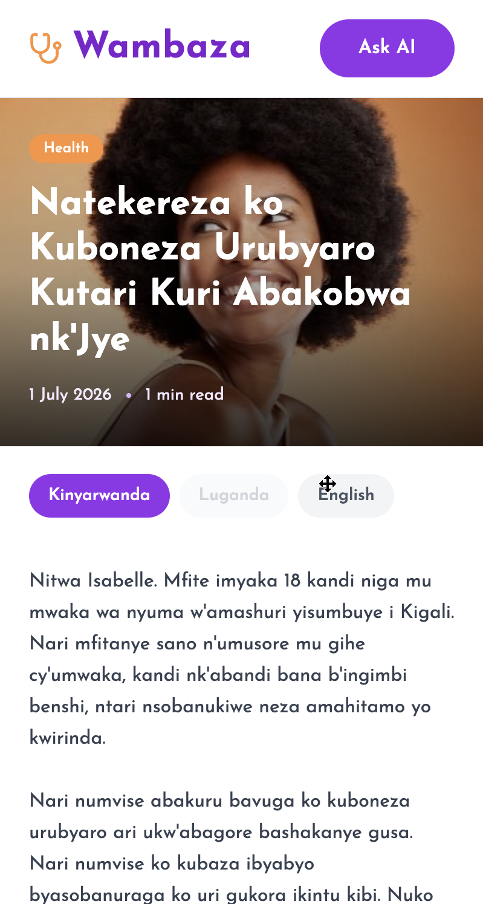

# Wambaza — Multilingual ASRH Platform

> **"Wambaza"** means *"you can ask me"* in Kinyarwanda.

Wambaza is a multilingual platform that delivers accurate, linguistically inclusive adolescent sexual and reproductive health (ASRH) guidance in **Kinyarwanda**, **Luganda**, and **English**. It serves adolescents in Rwanda, Uganda, and East Africa who face cultural stigma, language barriers, and limited access to private health information.

---

## The Problem

In Rwanda, teenage pregnancy has risen to 8% among girls aged 15 to 19, and in Uganda, adolescent girls account for roughly one third of all new HIV infections annually. Existing digital ASRH platforms are either rule-based, English-only, or geographically limited — no system currently provides intelligent, multilingual ASRH question answering in Kinyarwanda and Luganda.

## What Wambaza Does

- Publishes verified ASRH articles in Kinyarwanda, Luganda, and English, written and managed by approved publishers
- Lets adolescents browse, search, and read articles without creating an account
- Accepts ASRH questions anonymously through an AI chat assistant, with automatic language detection
- Gives admins tools to manage publisher accounts and moderate published content

This repo is the **frontend** (Next.js 14 + Tailwind). The API lives in the [backend repo](https://github.com/dianepretty/wambaza_backend).

---

## Frontend pages

| Route | Purpose |
|---|---|
| `/` | Homepage — hero, Ask AI banner, latest articles, trust stats |
| `/stories` | Full article catalogue with search |
| `/articles/[id]` | Public article reader, per-language tabs (KIN / LUG / SW / EN) |
| `/ask` | AI chat assistant, no login required |
| `/signin` | Publisher/admin sign-in, OTP-based forgot password |
| `/change-password` | Forced password change on first login |
| `/publisher` | Publisher dashboard — manage own articles (draft/published/archived) |
| `/publisher/editor` | Article editor — multilingual fields (KIN / LUG / SW / EN), header image upload |
| `/publisher/profile` | Publisher account settings (name/email) |
| `/admin` | Admin dashboard — manage publishers and moderate all articles |
| `/admin/profile` | Admin account settings (name/email) |

## Screenshots

       

## Local setup

### Prerequisites

- Node.js 18+

### Run locally

```bash
npm install
```

Create `.env.local` in the project root:

```
NEXT_PUBLIC_API_URL=http://localhost:8000
```

Point this at wherever the [backend](https://github.com/dianepretty/wambaza_backend) is running.

```bash
npm run dev
```

The app runs at `http://localhost:3000`.

---

## AI model

The AI assistant is powered by `DianePretty/Wambaza_2.0`, a fine-tuned multilingual text-generation model deployed as a [HuggingFace Space](https://huggingface.co/spaces/DianePretty/Wambaza-API).

The `/ask` page calls the backend `/model/ask` endpoint, which forwards the question to the Space via the Gradio REST API and returns an answer.

### Model training

The training notebook and data live in this repo for reference.

```
wambaza/
├── app/                                 # Next.js frontend (see table above)
├── Wambaza_Model_Notebook.ipynb         # Data analysis, model training, evaluation
```

The model pipeline:
- Fine-tuned on the **HASH Multilingual Health QA Challenge** (Zindi / ITU, 2026) — a health-worker-validated corpus of ASRH question-answer pairs
- Supports Kinyarwanda, Luganda, and English
- Deployed to HuggingFace Hub as `DianePretty/Wambaza_2.0`
- Served via a Gradio Space for persistent, always-on inference

| Split | Rows | Languages |
|---|---|---|
| Train | 21,444 | English, Luganda |
| Validation | 4,592 | English, Luganda |
| Test | 1,836 | English, Luganda |

### Running the notebook

1. Upload `Train.csv`, `Val.csv`, `Test.csv` to Google Drive under `MyDrive/Multilingual data/`
2. Open `Wambaza_Model_Notebook.ipynb` in [Google Colab](https://colab.research.google.com)
3. Set runtime to **T4 GPU** (`Runtime → Change runtime type → T4 GPU`)
4. Run all cells top to bottom

---

## Links

- [GitHub](https://github.com/dianepretty/wambaza)
- [Backend repo](https://github.com/dianepretty/wambaza_backend)
- [HuggingFace Model](https://huggingface.co/DianePretty/Wambaza_2.0)
- [HuggingFace Space](https://huggingface.co/spaces/DianePretty/Wambaza-API)
- [YouTube demo](https://drive.google.com/file/d/1fpeVSF9pSm_iK9ZtTckLbbv82qo6LggB/view?usp=sharing)

## Author

**Diane Pretty Ntakirutimana**
BSc. Software Engineering, African Leadership University
2026
